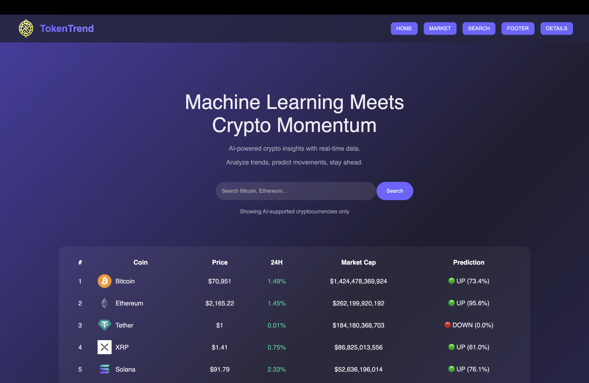
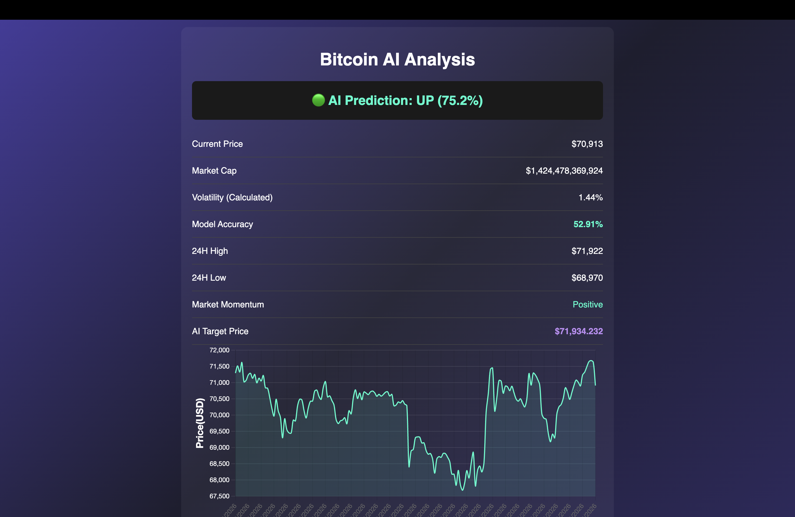

# Team Name: TeamVAJJ

## Team Members
* Member 1: Aditya Roy - [AdityaR17]
* Member 2: D S Mohanta Julliet - [Julliet-Mohanta]
* Member 3: Jayesh Agarwal - [JayeshJaquar]
* Member 4: Vidwathkalpa Gundaram - [vidwathkalpa28-glitch]

## 🔗 Project Links
* **PPT link:** [add link for ppt explaining your solution]
* **Hosted Demo:** [Link to live app, e.g., Vercel or Netlify]

## Technical Implementation

Explain whatever you have done in this points
### 1. Data Pipeline & Feature Engineering
This step is about preparing the data.
We combine the given data and clean it so it is useful.
Then we create new features from the data, like averages or changes.
This makes it easier for the model to understand patterns.
### 2. The Machine Learning Engine
This is where the model learns from the data.
We give the prepared data to the machine learning model.
The model studies patterns and learns how to predict results.

### 3. Interactive Web Dashboard & Inference
This is the part the user sees.
We build a dashboard (website) to show results clearly.
Users can see predictions instantly.
The model uploads the weights in json file and through that the website predicts the outcome.

##  Setup Instructions
1. Access the Project

Open the GitHub repository using the provided link.

2. Run Locally (Optional)

If you want to run the project on your system:

Clone the repository:

git clone <your-repo-link>

Navigate to the project folder:

cd <project-folder>

Run the application:

python app.py

(or the main file name you used)

3. Use the Hosted Website (Recommended)

Open the deployed website using the provided link.

No installation is required.

Simply interact with the dashboard and view predictions.

4. How to Use

Select or input the required data (e.g., token/coin).

Click on the predict button.

View the result (UP/DOWN) displayed on the dashboard.

##  Screenshots

